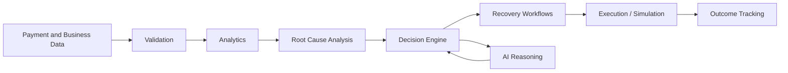

# AIRA

AIRA (Autonomous Intelligent Recovery Agent) is an intelligent payment recovery and revenue operations system designed to mitigate transaction failures and optimize revenue retention. It combines real-time payment telemetry, deterministic policy enforcement, and AI-assisted root-cause analysis to autonomously orchestrate recovery workflows across payment degradation events, failed subscriptions, and outstanding receivables. 

## Overview

AIRA operates as an intelligent revenue operations layer. Payment degradation and transaction failures can occur for a multitude of reasons, ranging from gateway timeouts and mandate drop-offs to insufficient funds and customer abandonment. Traditional systems typically react to failed payments with generic, uniform retry schedules. AIRA instead focuses on identifying the underlying root cause of a failure to dynamically select the most appropriate recovery strategy. 

The system leverages a hybrid approach. It utilizes analytics and deterministic decision logic for core business rules and regulatory compliance, while employing AI-assisted reasoning to analyze complex failure signals and recommend optimal recovery actions. 

The high-level operational flow of AIRA is as follows:

Payment and Business Data -> Data Validation -> Analytics and Detection -> Root Cause Analysis -> Recovery Decision -> Recovery Workflow -> Execution/Simulation -> Outcome Tracking.

*Note: In the current repository configuration, payment executions and recovery actions are simulated for demonstration and validation purposes.*

## Problem Statement

Businesses operating digital payments, recurring billing, and B2B receivables face significant revenue leakage due to unrecovered transactions. This leakage manifests across several scenarios:

- **Payment Failures:** Hard and soft declines during active transactions.
- **Payment Degradation:** Latency spikes or elevated error rates across specific payment corridors or gateways.
- **Checkout Abandonment:** Customers dropping off during the payment flow.
- **Failed Subscriptions:** Recurring billing attempts failing due to expired cards, insufficient funds, or mandate restrictions.
- **B2B Receivables:** Delayed invoice settlements and extended Days Sales Outstanding (DSO).
- **Mandate Failures:** Setup or execution failures of standing instructions or auto-debit mandates.
- **Delayed Payments:** Customers failing to meet agreed-upon payment timelines.

A generic retry system is insufficient to address these challenges because different failure scenarios require fundamentally different recovery strategies. Retrying a card with insufficient funds requires a different approach (e.g., waiting for salary day) than retrying a payment that failed due to a temporary gateway timeout (which requires immediate routing to a fallback gateway). Furthermore, effective recovery requires intelligent customer communication and prioritization to maximize recovered revenue without creating poor user experiences.

## Solution

AIRA addresses these challenges by decoupling the recovery process into distinct, specialized layers. This separation of concerns ensures that the system can adapt to diverse failure modes while maintaining strict adherence to business policies and regulatory requirements.

The system is separated into the following components:

1. **Analytics:** Monitors payment telemetry, tracks corridor health, and aggregates financial metrics.
2. **Root-Cause Detection:** Analyzes failure codes, customer context, and systemic signals to determine why a failure occurred.
3. **Decisioning:** A deterministic policy governor that evaluates proposed actions against business rules, rate limits, and compliance requirements (e.g., cooling-off periods).
4. **Recovery Workflow Orchestration:** Manages the state and progression of specific recovery cases based on the approved strategy.
5. **AI Reasoning:** Analyzes complex signals to recommend the optimal recovery action when deterministic rules are insufficient.
6. **Execution/Simulation:** Executes the approved recovery action or simulates the outcome for testing and demonstration.
7. **Outcome Tracking:** Logs all interventions to a tamper-evident audit trail and updates case status based on the result.

This architecture enables AIRA to transition from simply asking "what happened?" to "why did it happen?" and autonomously determining "what should happen next?"

## Core Capabilities

AIRA implements several specialized recovery workflows to address distinct revenue leakage vectors.

### Payment Degradation to Root Cause to Recovery Action
The system ingests real-time payment telemetry to detect degraded performance across specific payment corridors. When latency or error rates exceed acceptable thresholds, AIRA identifies the likely systemic cause (e.g., gateway timeout) and recommends a recovery action, such as automatically rerouting inflight transactions to a healthy fallback corridor.

### Checkout Drop-off Recovery
AIRA identifies instances of checkout abandonment by monitoring incomplete transaction sessions. The recovery workflow initiates targeted customer communication, such as dispatching a payment link with localized context, to re-engage the customer and recover the abandoned session.

### Failed Subscription Recovery
For recurring billing failures, AIRA analyzes the mandate status, retry history, and failure reason. It orchestrates a recovery sequence that may include liquidity-aware retries (e.g., timing retries around common salary credit dates) or transitioning to multi-channel dunning communications (e.g., SMS or WhatsApp reminders).

### B2B Receivables Chaser
The system monitors outstanding B2B invoices and categorizes them by aging buckets. It prioritizes accounts based on outstanding balance and risk, generating follow-up actions such as automated dispatch of settlement links or escalation for manual intervention.

### Mandate Retry Sequencer
Instead of blindly retrying failed auto-debit mandates, AIRA sequences retry attempts in compliance with regulatory cooling-off periods. It coordinates pre-debit notifications and adapts the retry strategy based on the specific mandate type and previous attempt outcomes.

### Hinglish Voice Recovery
AIRA includes capabilities for conversational customer engagement, utilizing AI-generated Hinglish communication to negotiate payment recovery. The generative AI is strictly constrained to communication generation and sentiment analysis, while the actual progression of the recovery workflow remains governed by deterministic logic.

### Promise-to-Pay Tracker
The system captures and monitors customer payment commitments (Promises-to-Pay) across various channels. It acts as a ledger to track whether commitments are kept, automatically updating invoice status and escalating broken promises to further recovery workflows.

## How AIRA Works

The end-to-end operation of AIRA follows a structured, ten-step pipeline:

1. **Data Ingestion:** The system ingests payment events, subscription updates, and business data from external gateways and internal services.
2. **Validation and Normalization:** Incoming data is validated against strict schemas (e.g., Pydantic models) and normalized into a standard internal format.
3. **Metrics Calculation:** The analytics engine processes the normalized data to update real-time metrics, such as corridor latency and error rates.
4. **Detection of Anomalies/Degradation:** Threshold monitors continuously evaluate metrics to detect anomalies or degraded performance that require intervention.
5. **Root-Cause Analysis:** When an issue is detected, the system analyzes the available signals (failure codes, customer history) to determine the root cause. This step may utilize AI reasoning for complex or ambiguous signals.
6. **Customer/Business Prioritization:** Recovery cases are prioritized based on the amount at risk, customer segment, and probability of recovery.
7. **Recovery Strategy Selection:** A recovery strategy is formulated based on the identified root cause.
8. **AI Reasoning or Communication Generation:** If the strategy requires customer engagement, AI may be used to generate contextual communication or analyze response sentiment.
9. **Recovery Action Execution/Simulation:** The proposed strategy is evaluated by the deterministic Policy Governor. If approved, the action is executed (or simulated in the current repository state). Business-critical calculations and workflow decisions do not depend blindly on an LLM; they are strictly enforced by the Policy Governor.
10. **Outcome Tracking:** The result of the intervention is recorded in an immutable audit ledger, and the case state is updated accordingly.

## Architecture

AIRA is built on a modern, decoupled architecture utilizing React, FastAPI, and asynchronous data processing.

- **Frontend:** A React 19 application utilizing TypeScript and Vite. It features an operational command center built with specialized UI components for data visualization and state management. An in-memory reactive data service ensures UI fidelity even when the backend is offline.
- **Backend/API:** A Python 3.11+ backend powered by FastAPI. It exposes RESTful routes for cases, invoices, metrics, and recovery operations.
- **Data Layer:** Utilizes asynchronous SQLAlchemy with SQLite (or PostgreSQL) for persistent storage of cases, customers, mandates, and audit events.
- **Analytics Layer:** Processes incoming telemetry to calculate real-time metrics and detect corridor degradation.
- **Decision Engine:** The Policy Governor enforces deterministic business rules, rate limits, and regulatory constraints before any action is executed.
- **Recovery Workflow Engine:** Orchestrates the step-by-step execution of specific recovery scenarios based on the case state.
- **AI/Gemini Integration:** Leverages the Google Gemini API for root-cause classification and communication generation, acting as an advisory input to the deterministic engine.
- **Validation:** Pydantic is used extensively for data validation and configuration management.
- **Testing:** Comprehensive test suites using Pytest for the backend and TSX for frontend state verification. A mock AI provider ensures deterministic CI pipelines.
- **Build/Deployment:** The repository includes scripts for database seeding, dataset validation, and local CI verification, facilitating easy deployment and testing.



## Setup and Installation

### Prerequisites
- Node.js v18.0.0+ (v20+ recommended)
- Python v3.11+
- Git

### Backend Setup
1. Navigate to the `backend` directory.
2. Create and activate a Python virtual environment.
3. Install dependencies: `pip install -r requirements.txt`
4. Copy `.env.example` to `.env` in the root directory.
5. Generate and seed the database: `py enrich_db.py`
6. Start the FastAPI server: `uvicorn app.main:app --reload --host 0.0.0.0 --port 8000`

### Frontend Setup
1. Navigate to the `frontend` directory.
2. Install dependencies: `npm install`
3. Start the development server: `npm run dev`

### Gemini AI Configuration
The system uses a mock AI provider by default for deterministic behavior. To enable live AI reasoning:
1. Obtain a Google Gemini API key.
2. Set the `GEMINI_API_KEY` environment variable in your `.env` file.
3. Set `AI_PROVIDER=gemini` in your `.env` file.

## Testing and Validation
The project includes a robust local CI pipeline to validate datasets, verify architecture, and run test suites. 

Run the complete offline CI suite from the repository root:
```bash
npm run ci
```

To run live integration tests with Gemini (requires `GEMINI_API_KEY`):
```bash
npm run test:gemini
```
